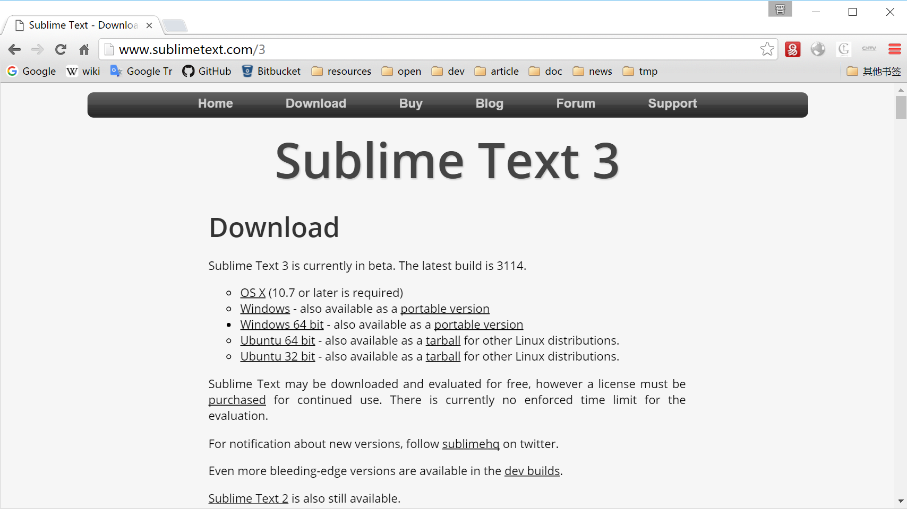
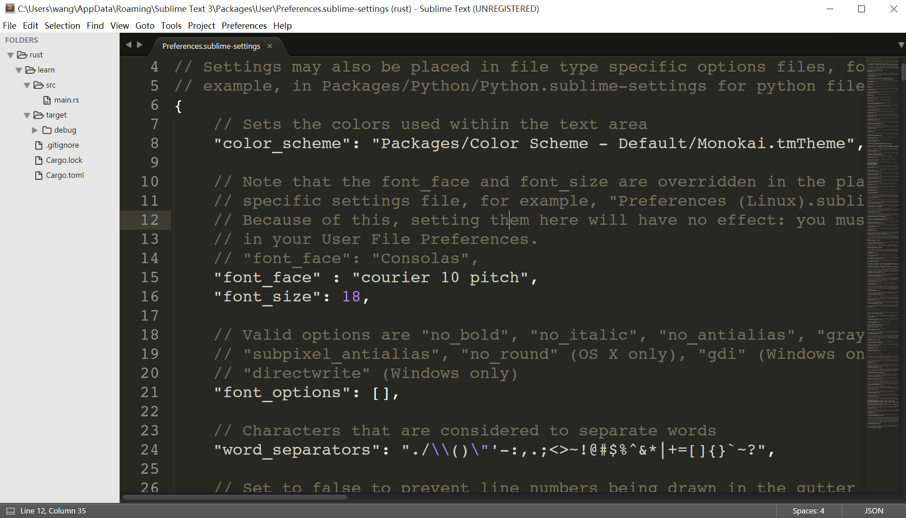
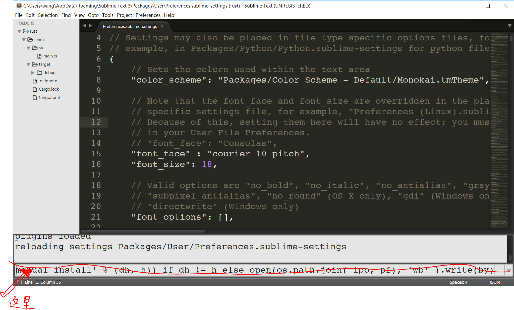
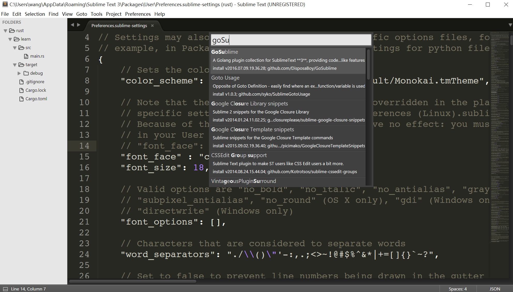
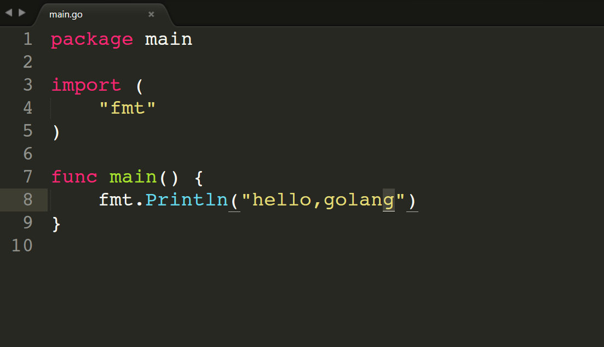

1.2 开发环境的搭建
==================

[**章目录**](./ch01.md)
[**上一节**](./ch01-01-install-go.md)
[**下一节**](./ch01-03-resources.md)

---

Go 的开发工具有很多，官方有一份[IDE及插件列表][]，收录了很多可以开发 Go 程序的IDE或者编辑器插件。
这一节简要介绍一下 Sublime Text 3 下安装 Go 开发环境。

## [Sublime Text 3][]

首先到这里下载 [Sublime Text 3][]，你需要根据你使用的系统来决定下载哪一个文件。

下载完成后安装，基本上一路下一步就可以了。安装完成后启动 Sublime。

> 如果你启动后觉得字体太小或字体不好看，可以在菜单中点击 `Preferences` -> `Settings - User`，然后设置 `font_face` 和 `font_size`。

完了再安装 `package control`，这个用来管理 Sublime 的插件。
点击菜单中的 `View` -> `Show console`，然后在底下的输入框中复制以下文本，再按 Enter 键

	import urllib.request,os,hashlib; h = '2915d1851351e5ee549c20394736b442' + '8bc59f460fa1548d1514676163dafc88'; pf = 'Package Control.sublime-package'; ipp = sublime.installed_packages_path(); urllib.request.install_opener( urllib.request.build_opener( urllib.request.ProxyHandler()) ); by = urllib.request.urlopen( 'http://packagecontrol.io/' + pf.replace(' ', '%20')).read(); dh = hashlib.sha256(by).hexdigest(); print('Error validating download (got %s instead of %s), please try manual install' % (dh, h)) if dh != h else open(os.path.join( ipp, pf), 'wb' ).write(by)

> 这段文本取自这个站点 [https://packagecontrol.io/installation](https://packagecontrol.io/installation)

稍等一小会儿，`package control` 就安装完毕。然后你需要 **重新启动** Sublime。
重启之后按快捷键 `Ctrl-Shift-p`(OS X 系统下按`Cmd-Shift-P`)，在sublime 菜单栏下面弹出的小输入框中输入 `pi` 再按 Enter，稍等几秒后在输入框中搜索 `GoSublime`，然后按 Enter 安装插件 `GoSublime`。

安装完成后再重启一下 Sublime。
现在建一个新文件 `main.go` 并输入以下内容:

输入的过程是否出现了自动补全？输完后的效果是否和上图一样？

## 有疑问？
这一部分如果有问题请搜索查找有关Go的开发环境的搭建。

[IDE及插件列表]: https://github.com/golang/go/wiki/IDEsAndTextEditorPlugins
[Sublime Text 3]: http://www.sublimetext.com/3 "Sublime"

---
[**章目录**](./ch01.md)
[**上一节**](./ch01-01-install-go.md)
[**下一节**](./ch01-03-resources.md)
